# E-Commerce Order Management System

A backend application for managing customers, products, shopping carts, orders, payments, returns, reviews, and sales reports.

## Technologies Used

- Python 3.12
- FastAPI
- Pydantic
- SQLAlchemy
- MySQL
- Alembic
- JWT Authentication
- Passlib
- Bcrypt
- SMTP Email
- Uvicorn

## Features

### Authentication

- Customer registration
- Customer login
- JWT authentication
- Current user details
- Admin authentication
- Customer and Admin roles
- Password hashing
- Active user validation

### Categories

- Create category
- View categories
- Update category
- Soft delete category
- Category pagination
- Admin-only category management

### Products

- Create product
- View products
- Update product
- Soft delete product
- Search products by name
- Filter by category
- Filter by price range
- Filter products by stock
- Sort by price
- Sort by created date
- Ascending and descending order
- Pagination

### Cart

- Add products to cart
- Update cart item quantity
- Delete cart item
- Clear cart
- View customer cart
- Cart item pagination
- Stock validation

### Addresses

- Add customer address
- View customer addresses
- Update address
- Delete address
- Default address support
- Customer-specific address access
- Pagination

### Orders

- Create order from cart
- Validate customer address
- Validate product stock
- Calculate subtotal
- Calculate tax
- Calculate delivery charge
- Calculate grand total
- Reduce product stock
- Clear cart after order creation
- Customer order history
- Admin order management
- Order status updates
- Order pagination

### Payments

- Create payment
- Payment status tracking
- Transaction ID
- Payment amount
- Customer payment access
- Admin payment list
- Pagination

### Returns

- Create return request
- Return only delivered orders
- Prevent duplicate return requests
- Approve return
- Reject return
- Rejection reason
- Refund amount
- Customer return history
- Admin return management
- Pagination

### Reviews

- Customers can review purchased products
- Only delivered orders are eligible for reviews
- One review per product per customer
- Update review
- Delete review
- View product reviews
- View customer reviews
- Review pagination

### Email Notifications

- Order status email notifications
- Background email processing using FastAPI BackgroundTasks
- SMTP email configuration

### Reports

- Total orders
- Total sales
- Pending orders
- Confirmed orders
- Shipped orders
- Delivered orders
- Cancelled orders
- Total customers
- Total products
- Low stock products

## Project Structure

```text
E-Commerce Order Management System/
│
├── app/
│   ├── auth/
│   ├── models/
│   ├── routers/
│   ├── schemas/
│   ├── services/
│   ├── utils/
│   ├── database.py
│   └── main.py
│
├── alembic/
│   └── versions/
│──screenshots/
├── .env.example
├── .gitignore
├── alembic.ini
├── create_admin.py
├── README.md
└── requirements.txt


## API Screenshots

### Authentication

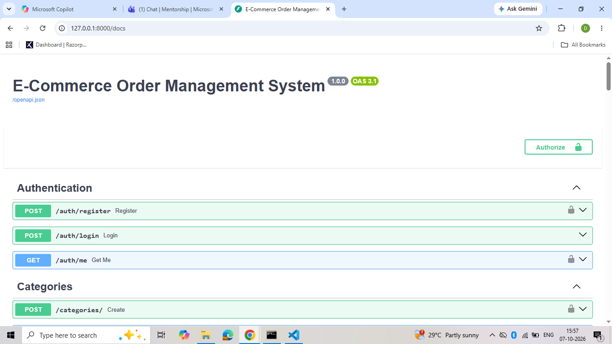

### Categories

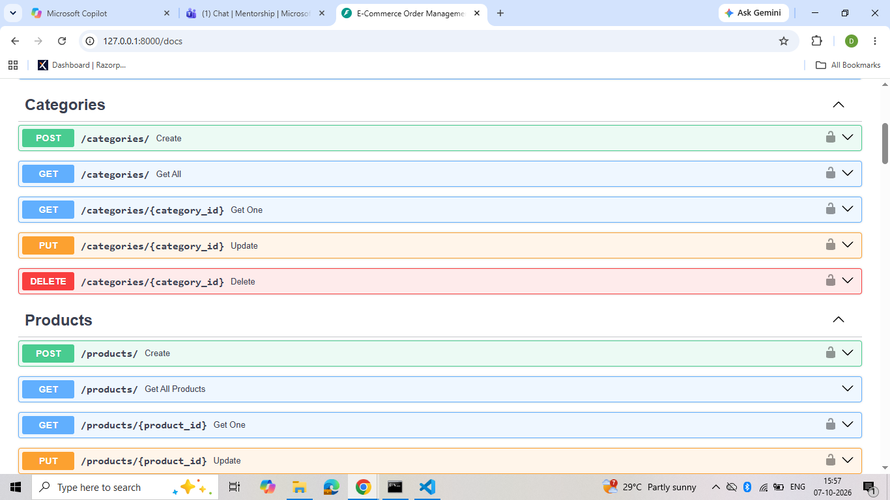

### Products

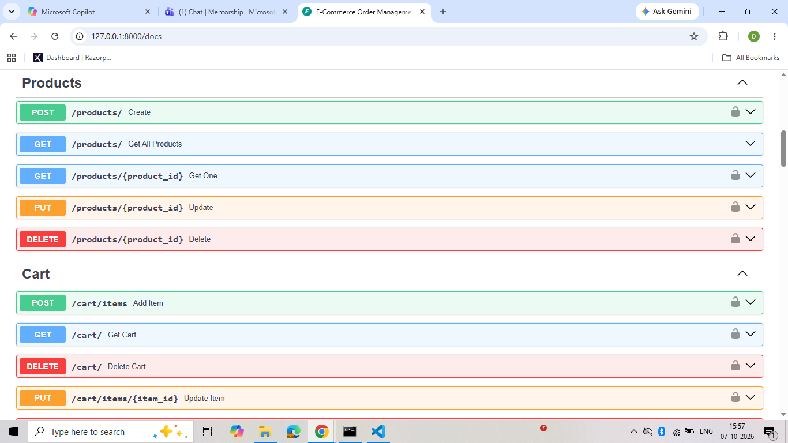

### Cart

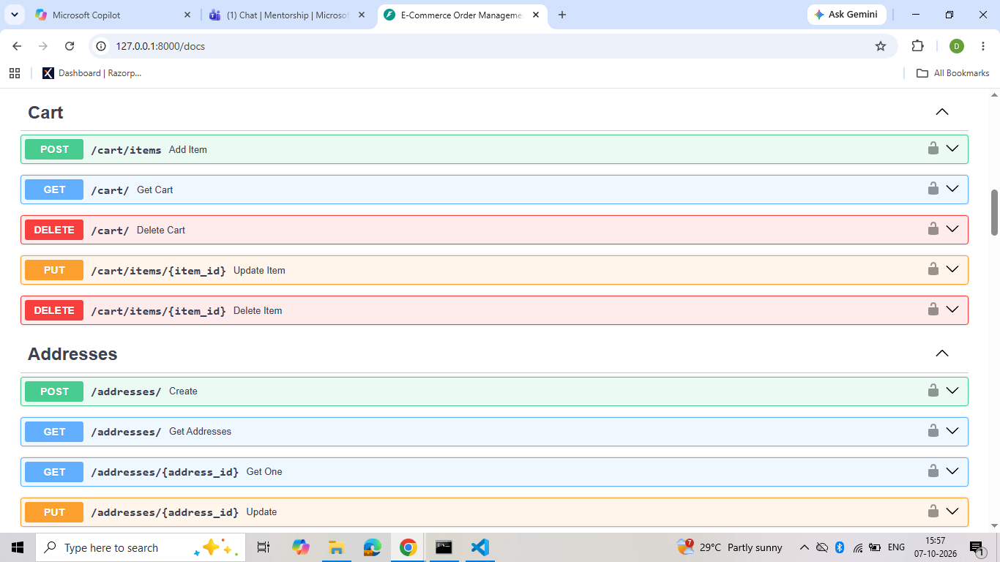

### Addresses

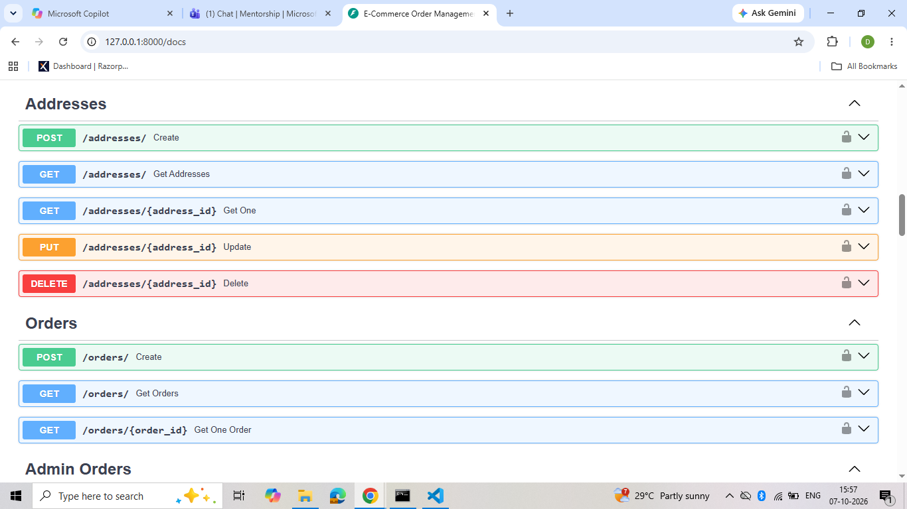

### Orders

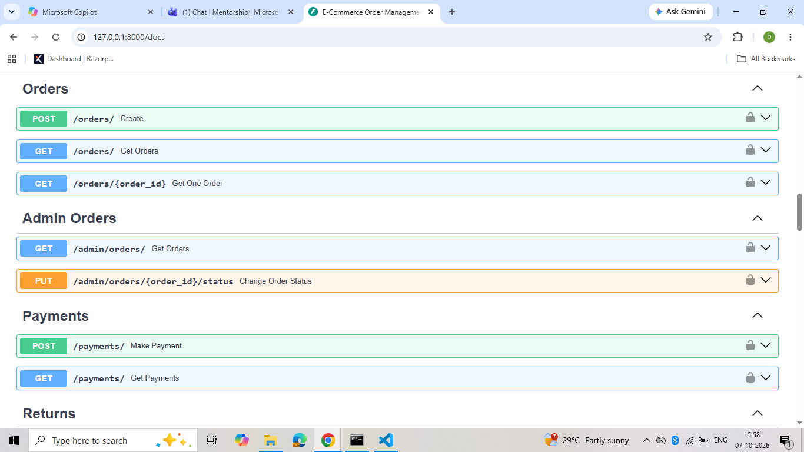

### Payments

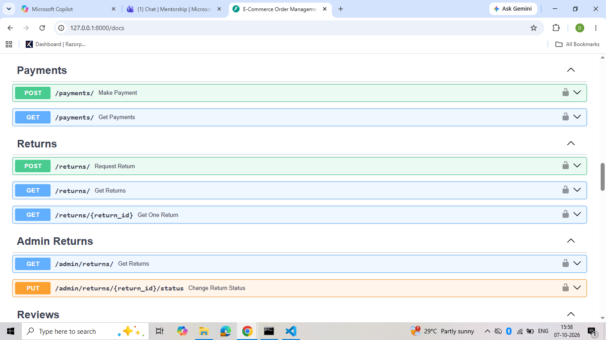

### Returns

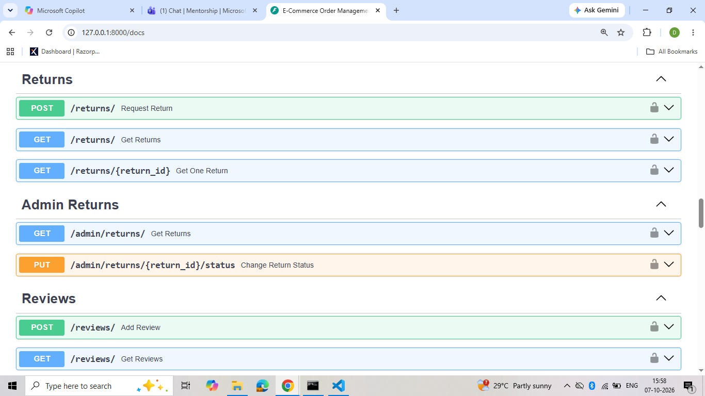

### Admin Returns

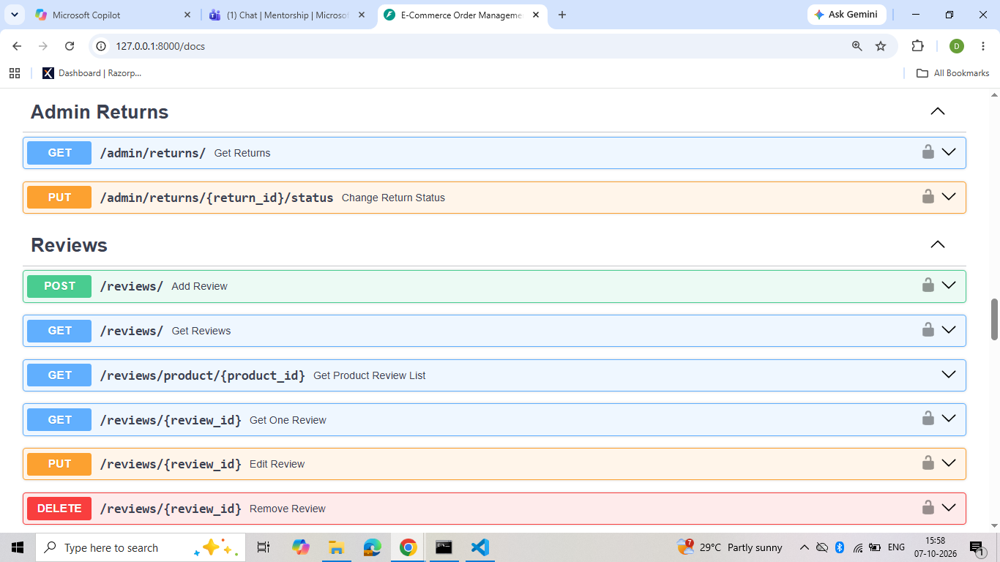

### Reviews

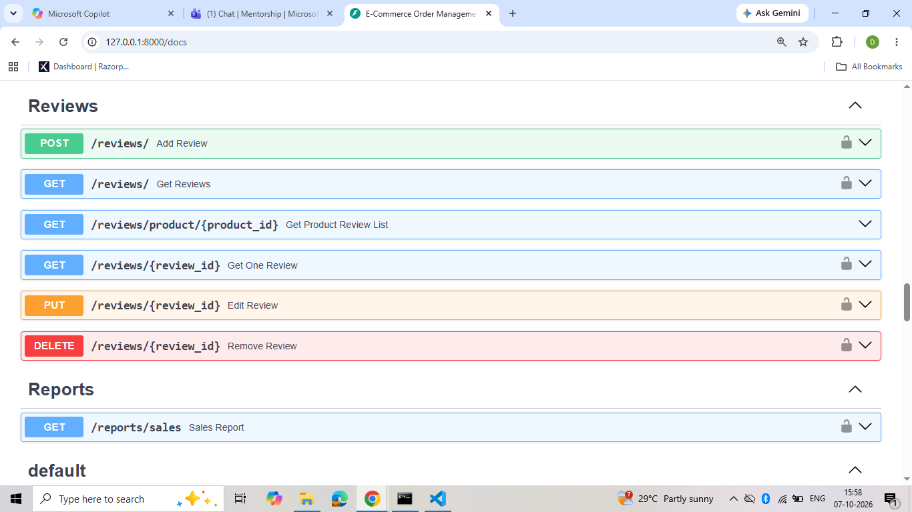

### Reports

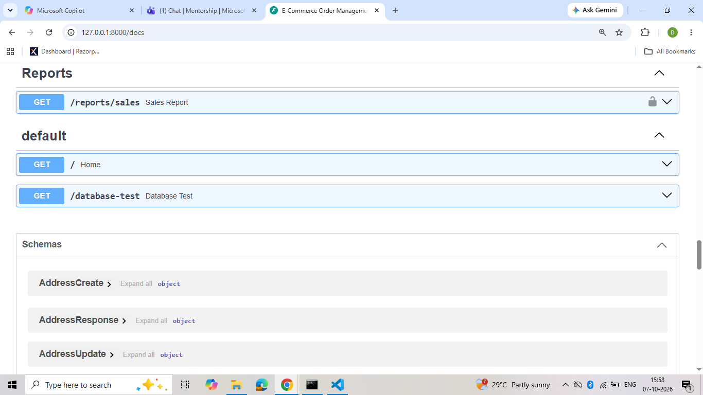